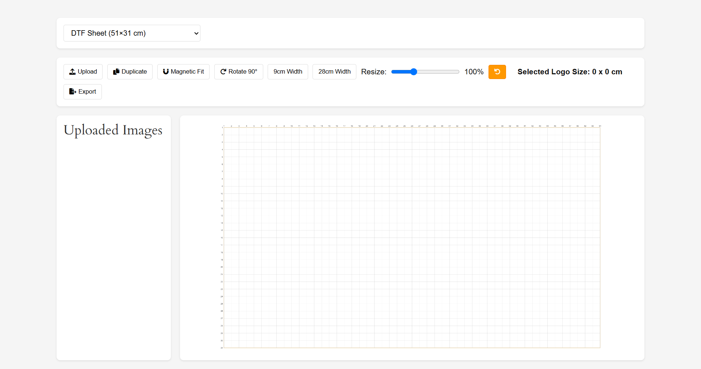

# Custom Image Layout Tool

A flexible and user-friendly WordPress plugin that provides a custom canvas-based image layout tool. Upload, resize, rotate, duplicate, and arrange images on a customizable sheet with snapping grid functionality and export options.

## 🔧 Features

- Upload multiple images
- Drag & drop image positioning
- Resize with handles or slider
- Rotate images 90°
- Snap to grid toggle
- Duplicate images
- Set image size manually (in cm)
- Export layout as JPG or PNG
- Sheet size selector: DTF, Screen, Dye-Block
- Live image size display
- Responsive layout and modern UI

## 📦 Installation

1. Download or clone this repository.
2. Upload the plugin folder to `wp-content/plugins/custom-image-layout-tool`.
3. Activate the plugin via the WordPress admin dashboard.
4. Add the shortcode `[custom_image_layout]` to any page or post.

## 🖼️ Usage

Place this shortcode where you want to show the layout tool:

```
[custom_image_layout]
```

## 📁 Folder Structure

```
custom-image-layout-tool/
│
├── assets/
│   ├── css/
│   │   └── style.css
│   ├── js/
│   │   ├── config.js
│   │   └── canvas.js
│   └── images/
│       └── logo.PNG
├── custom-image-layout-tool.php
├── README.md
```

## 🚀 Compatibility

- WordPress 5.5+
- Works with all modern themes
- Tested with Gutenberg and Classic Editor

## Screenshot




## Contact & Credits

Developed by [The Pro Developer](mailto:theprodeveloper789@gmail.com).

For feedback, suggestions, or collaboration, feel free to reach out!

---